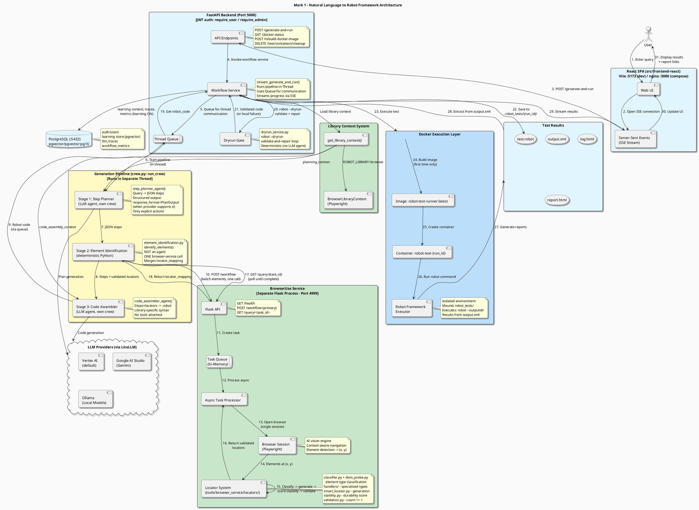

# Architecture Overview

Mark 1 turns natural language into working Robot Framework tests using **two LLM
agents (Step Planner, Code Assembler) wrapped around deterministic stages**: a
Python element-identification stage backed by a vision-AI browser service, and a
deterministic `robot --dryrun` validation gate. Generated tests execute in isolated
Docker containers.

> Re-aligned with code on 2026-07-11 (Task 23, locator-enhancement program).
> If this document and the code disagree, the code wins — please fix the doc.

## System Architecture

### PlantUML Diagram


```plantuml
@startuml Mark1_Architecture

!define RECTANGLE_COLOR #E1F5FE
!define AGENT_COLOR #FFF9C4
!define SERVICE_COLOR #C8E6C9
!define DOCKER_COLOR #BBDEFB

skinparam backgroundColor #FAFAFA
skinparam roundcorner 10
skinparam shadowing true

title Mark 1 - Natural Language to Robot Framework Architecture

' User and Frontend
actor "User" as user
rectangle "React SPA (src/frontend-react)\nVite :5173 (dev) / nginx :3000 (compose)" as frontend #E1F5FE {
  component "Web UI" as webui
  component "Server-Sent Events\n(SSE Stream)" as sse
}

' Backend API Layer
rectangle "FastAPI Backend (Port 5000)\n[JWT auth: require_user / require_admin]" as backend #E1F5FE {
  component "API Endpoints" as api
  note right of api
    POST /generate-and-run
    GET /docker-status
    POST /rebuild-docker-image
    DELETE /test/containers/cleanup
  end note

  component "Workflow Service" as workflow
  note right of workflow
    stream_generate_and_run()
    Runs pipeline in Thread
    Uses Queue for communication
    Streams progress via SSE
  end note

  component "Dryrun Gate" as dryrun
  note right of dryrun
    dryrun_service.py
    robot --dryrun
    validate-and-repair loop
    Deterministic (no LLM agent)
  end note

  queue "Thread Queue" as threadqueue
}

' Generation pipeline - two LLM agents around deterministic Python
rectangle "Generation Pipeline (crew.py: run_crew)\n[Runs in Separate Thread]" as pipeline #FFF9C4 {
  component "Stage 1: Step Planner\n(LLM agent, own crew)" as planner
  note right of planner
    step_planner_agent()
    Query -> JSON steps
    Structured output:
    response_format=PlanOutput
    (when provider supports it)
    Only explicit actions
  end note

  component "Stage 2: Element Identification\n(deterministic Python)" as ident
  note right of ident
    element_identification.py
    identify_elements()
    NOT an agent
    ONE browser-service call
    Merges locator_mapping
  end note

  component "Stage 3: Code Assembler\n(LLM agent, own crew)" as assembler
  note right of assembler
    code_assembler_agent()
    Steps+locators -> .robot
    Library-specific syntax
    No tools attached
  end note
}

' Library Context System
rectangle "Library Context System" as libcontext #C8E6C9 {
  component "get_library_context()" as factory
  component "BrowserLibraryContext\n(Playwright)" as browser
  factory --> browser : ROBOT_LIBRARY=browser
}

' BrowserUse Service - SEPARATE PROCESS
rectangle "BrowserUse Service\n[Separate Flask Process - Port 4999]" as browseruse #C8E6C9 {
  component "Flask API" as flaskapi
  note right of flaskapi
    GET /health
    POST /workflow (primary)
    GET /query/<task_id>
  end note

  queue "Task Queue\n(In-Memory)" as taskqueue

  component "Async Task Processor" as taskproc

  component "Browser Session\n(Playwright)" as vision
  note right of vision
    AI vision engine
    Context-aware navigation
    Element detection -> (x, y)
  end note

  component "Locator System\n(tools/browser_service/locators/)" as locsys
  note right of locsys
    classifier.py + dom_probe.py
      element type classification
    handlers/ - specialized types
    smart_locator.py - generation
    stability.py - durability score
    validation.py - count == 1
  end note
}

' Persistence
database "PostgreSQL (:5432)\npgvector/pgvector:pg16" as postgres #E1F5FE
note right of postgres
  auth/users
  learning store (pgvector)
  llm_traces
  workflow_metrics
end note

' Docker Execution
rectangle "Docker Execution Layer" as docker #BBDEFB {
  component "Image: robot-test-runner:latest" as builder
  component "Container: robot-test-{run_id}" as container
  component "Robot Framework\nExecutor" as executor
  note right of executor
    Isolated environment
    Mounts robot_tests/
    Executes: robot --outputdir
    Results from output.xml
  end note
}

' Results and Reports
rectangle "Test Results" as results #E1F5FE {
  storage "test.robot" as robotfile
  storage "output.xml" as outputxml
  storage "log.html" as loghtml
  storage "report.html" as reporthtml
}

' LLM Provider (via LiteLLM only)
cloud "LLM Providers (via LiteLLM)" as llm {
  component "Vertex AI\n(default)" as vertex
  component "Google AI Studio\n(Gemini)" as gemini
  component "Ollama\n(Local Models)" as ollama
}

' ===== FLOW CONNECTIONS =====

user --> webui : 1. Enter query
webui --> sse : 2. Open SSE connection
sse --> api : 3. POST /generate-and-run

api --> workflow : 4. Invoke workflow service
workflow --> threadqueue : 5. Queue for thread\ncommunication
threadqueue --> planner : 6. Start pipeline\n(in thread)

planner --> ident : 7. JSON steps
ident --> assembler : 8. Steps + validated locators
assembler --> threadqueue : 9. Robot code\n(via queue)

workflow --> factory : Load library context
factory --> planner : planning_context
factory --> assembler : code_assembly_context

ident --> flaskapi : 10. POST /workflow\n(batch elements, one call)
flaskapi --> taskqueue : 11. Create task
taskqueue --> taskproc : 12. Process async
taskproc --> vision : 13. Open browser\n(single session)
vision --> locsys : 14. Elements at (x, y)
locsys --> locsys : 15. Classify -> generate ->\nscore stability -> validate
locsys --> taskproc : 16. Return validated\nlocators
ident --> flaskapi : 17. GET /query/{task_id}\n(poll until complete)
flaskapi --> ident : 18. Return locator_mapping

planner --> llm : Plan generation
assembler --> llm : Code generation

workflow --> postgres : learning context, traces,\nmetrics (learning ON)

threadqueue --> workflow : 19. Get robot_code
workflow --> dryrun : 20. robot --dryrun\nvalidate + repair
dryrun --> workflow : 21. Validated code\n(or loud failure)
workflow --> robotfile : 22. Save to\nrobot_tests/{run_id}/
workflow --> docker : 23. Execute test
docker --> builder : 24. Build image\n(first time only)
builder --> container : 25. Create container
container --> executor : 26. Run robot command
executor --> results : 27. Generate reports

results --> workflow : 28. Extract from output.xml
workflow --> sse : 29. Stream results
sse --> webui : 30. Update UI
webui --> user : 31. Display results\n+ report links

@enduml
```

## Key Design Decisions

### Why two LLM agents around deterministic stages?

LLMs are used only where language understanding is genuinely needed (planning,
code assembly). Everything that can be deterministic is deterministic:
- Element identification is plain Python + one browser-service call — no agent
  round-trips, no LLM cost, no nondeterminism.
- Validation is `robot --dryrun` — a real Robot Framework parse, not an LLM
  opinion about validity. A Code Validator agent existed once and was removed:
  the dryrun gate is cheaper, deterministic, and actually catches errors.
- The planner emits schema-enforced JSON (`response_format=PlanOutput`) where the
  provider supports it, eliminating output-format salvage on that stage.

### Why AI Vision?

Traditional element detection (record-and-playback) fails on dynamic websites. AI vision:
- Understands context and intent
- Finds elements from natural-language descriptions
- Feeds a deterministic locator pipeline that generates stable, validated locators

### Why Docker?

Isolated execution ensures:
- No dependency conflicts
- Clean state per test
- Reproducible results
- Easy CI/CD integration

### What about self-healing?

There is **no runtime self-healing**. The old healing system (~4,695 lines) was
removed in November 2025. When a site changes and a locator breaks, the recovery
path is **regeneration**: re-run the same natural-language query and Mark 1
re-plans against the current page. Re-introducing runtime healing is deliberately
gated on failure-classification evidence (locator-enhancement program, Task 21/25).

## Locator Extraction & Validation Pipeline (Detailed)

Code lives in `tools/browser_service/locators/` (synced from the separate
`browser-service` repository — make changes there).

### Stage 1: Element Detection (Vision AI)
**Location**: BrowserUse Service → Browser Session (Playwright)
- Browser-use agent with vision AI navigates to the target URL
- Understands natural-language descriptions (e.g., "search box in header")
- Returns element center coordinates `(x, y)`
- Handles popups and dynamic content contextually

### Stage 2: Element Classification
**Location**: `classifier.py`, `dom_probe.py`, `handlers/`
- Tiered DOM-first classifier determines the element's type and framework
  before strategy dispatch
- `dom_probe.py` asks the live DOM whether the element structurally matches a
  specialized type (dropdown / checkbox / radio / collection) — independent of
  any LLM classification
- Specialized types dispatch to handlers (`dropdown.py`, `checkbox.py`,
  `collection.py`, `date_picker.py`, `file_upload.py`, …)

### Stage 3: Locator Generation
**Location**: `smart_locator.py`
- Deterministic multi-strategy extraction from coordinates
- Attribute priority (most → least stable): `id`, `data-testid`/`data-test`/
  `data-qa`, `name`, `aria-label`, text content, role, CSS classes
- Library-aware formatting (Browser Library / Playwright syntax)

### Stage 4: Stability Scoring
**Location**: `stability.py`
- The pipeline validates candidates against the live page ("unique right now"),
  but the generated test runs in a fresh session, minutes to months later
- Stability scoring ranks candidates for durability across that gap; the most
  stable validated candidate wins

### Stage 5: Validation
**Location**: `validation.py`
- Uses Playwright's built-in Python API (no JavaScript generation):
  `await page.locator(locator).count()`
- **CRITICAL VALIDATION RULE**:
  ```python
  valid = (count == 1)  # Only unique locators are valid
  ```
  - count > 1: multiple matches → not usable
  - count = 0: element not found
  - count = 1: unique match → valid
- F12-style validation — same as testing in browser DevTools

## Performance Characteristics

Measured on the 30-query benchmark, 2026-07-11 (Vertex, gemini-flash pins):
- **Pass rate**: 93.3% (28/30), locator success 1.0
- **End-to-end (generate + execute)**: median ~37s, p90 ~52s
- **LLM calls per run**: median 4 (planner 1, assembler 1, browser-use ~2-3)
- **LLM cost per run**: median ~$0.07

Each successful run writes one `workflow_metrics` row (JSONB). Alongside the cost and
locator totals it carries `workflow_duration_s` (whole-run wall time — distinct from
`execution_time`, which is the browser-use figure), the dryrun gate's own
`dryrun_status`/`dryrun_attempts`/`dryrun_repairs`, `crew_stage_metrics` (duration and
LLM usage for `planner`, `assembler`, and `repair` when the gate re-prompted), and
`guardrail_attempts` per attachment site. Generation *failures* write no metrics row —
they are recorded in `test_runs` with status `'error'` and an `error_message`. See
[OBSERVABILITY_GRAFANA.md](OBSERVABILITY_GRAFANA.md) for the queries.

## Scalability

- Up to `MAX_CONCURRENT_WORKFLOWS` (default 10, see `config.py`) workflows in parallel
- The BrowserUse service processes one workflow at a time (busy → 429)
- Future improvements: parallel element detection, distributed execution

## Security Model

- **JWT authentication** on the API (`require_user` / `require_admin`,
  `src/backend/auth/`); the app refuses to start with a placeholder `JWT_SECRET_KEY`
- **Persistence in PostgreSQL**: auth/users, learning store, LLM traces, workflow
  metrics (the system is NOT stateless)
- Docker isolation for test execution
- Optional local AI models (Ollama) for fully-local LLM inference

## Library Context Architecture

Mark 1 uses a flexible library context system to support multiple Robot Framework libraries:

```
src/backend/crew_ai/library_context/
├── base.py                    # Abstract base class
├── browser_context.py         # Browser Library (Playwright)
├── dynamic_context.py         # Dynamic keyword extraction
└── __init__.py               # Factory function
```

**Adding a new library:**

1. Create new context class:
```python
# my_library_context.py
from .base import LibraryContext

class MyLibraryContext(LibraryContext):
    @property
    def library_name(self) -> str:
        return "MyLibrary"

    @property
    def planning_context(self) -> str:
        return "Keywords and best practices..."

    # Implement other required methods
```

2. Register in factory:
```python
# __init__.py
def get_library_context(library_type: str):
    if library_type == "mylibrary":
        return MyLibraryContext()
```

3. Update configuration:
```python
# config.py
@validator('ROBOT_LIBRARY')
def validate_robot_library(cls, v):
    if v.lower() not in ['browser', 'mylibrary']:
        raise ValueError(...)
```

## Extension Points

Mark 1 is designed to be extensible:

1. **New Robot Framework Libraries**
   - Add library context in `library_context/`
   - Implement LibraryContext interface
   - Update configuration validator
   - Example: AppiumLibrary for mobile testing

2. **New AI Models**
   - Configure in `.env`
   - Supported via LiteLLM
   - Example: Claude, GPT-4, local models

3. **New Pipeline Stages**
   - Prefer deterministic Python stages in `crew.py` over new LLM agents
   - Add an agent only when language understanding is genuinely required

4. **New Test Types**
   - Extend agent capabilities
   - Add new task definitions
   - Example: API testing, mobile testing

## Learn More

- [Configuration Guide](CONFIGURATION.md)
- [Best Practices](BEST_PRACTICES.md)
- [Contributing Guide](../CONTRIBUTING.md)

---

## Detailed Code Flow Analysis

### Step-by-Step Execution Trace

#### Phase 1: User Input → API (Frontend → Backend)
```
1. User enters: "Search for shoes on Flipkart"
2. React SPA: Opens EventSource to /generate-and-run (JWT attached)
3. endpoints.py: generate_and_run_streaming()
4. Returns: StreamingResponse(stream_generate_and_run())
```

#### Phase 2: Workflow Initialization (API → Thread)
```
5. workflow_service.py: stream_generate_and_run()
6. Creates Thread: run_workflow_in_thread()
7. Thread runs: run_agentic_workflow()
8. Queue created for thread<->async communication
```

#### Phase 3: Generation Pipeline (crew.py: run_crew)
```
9.  crew.py: run_crew()
10. Loads: get_library_context(ROBOT_LIBRARY)
11. Initializes: RobotAgents(model_provider, model_name, library_context)
    (learning ON: optimized planner/assembler context — including relevant
     keyword knowledge — fetched from the learning store)

Stage 1 — Step Planner (LLM agent, own single-task crew):
  Input:  "Search for shoes on Flipkart"
  Output: JSON steps (PlanOutput schema enforced where supported), e.g.
    [
      {"keyword": "New Browser", "browser": "chromium"},
      {"keyword": "New Page", "value": "https://flipkart.com"},
      {"keyword": "Fill Text", "element_description": "search box", "value": "shoes"},
      {"keyword": "Keyboard Key", "value": "Enter"}
    ]

Stage 2 — Element identification (deterministic Python, NOT an agent):
  element_identification.py: identify_elements()
  → extracts the plan URL (navigation keywords, literal-URL fallback)
  → ONE BatchBrowserUseTool call: POST /workflow to the BrowserUse service
  → service opens a single Playwright session, vision AI finds ALL elements,
    locator pipeline classifies/generates/scores/validates locators
  → polls GET /query/{task_id} until complete
  → merges returned locator_mapping into the steps

Stage 3 — Code Assembler (LLM agent, own single-task crew):
  Input:  Steps with validated locators
  Uses:   library_context.code_assembly_context
          (no tools — per-query keyword knowledge arrives via the
           optimized context when learning is ON)
  Output: Complete .robot file — extracted from the assembler crew's
          tasks[-1].output.raw
```

#### Phase 4: Dryrun Gate, Code Saving & Docker Execution
```
12. workflow_service.py: robot --dryrun validate-and-repair loop
    (dryrun_service.validate_and_repair — deterministic; unrepairable → loud fail)
13. Generates run_id: uuid.uuid4()
14. Saves: robot_tests/{run_id}/test.robot
15. docker_service.py: get_docker_client()
16. build_image() - only if image doesn't exist (one-time, ~2-5 min)
17. run_test_in_container(run_id, test_filename)
18. Creates container: robot-test-{run_id}
    (pre-execution cleanup removes any name-conflicting container)
19. Executes: robot --outputdir /app/robot_tests/{run_id} test.robot
20. Waits for completion: container.wait() → exit code
21. Extracts results by parsing output.xml (never container.logs() —
    Docker logs can truncate; output.xml is structured and reliable)
22. Cleans up container (force-remove on failure paths too)
```

#### Phase 5: Results Streaming (Docker → User)
```
23. workflow_service.py: Yields results to queue
24. stream_generate_and_run(): Reads from queue
25. Formats: f"data: {json.dumps(event)}\n\n"
26. SSE stream sends to browser
27. React SPA receives events, updates UI
28. Shows links: /reports/{run_id}/log.html
29. Learning (when ON): workflow_service._process_learning() records the
    execution via the LearningWriteQueue — never blocks the pipeline
```

### Key Architectural Decisions

1. **Threading Model**: the pipeline runs in a separate thread to avoid blocking
   async FastAPI — `workflow_service.py:run_workflow_in_thread()`, Python Queue
   for inter-thread communication.

2. **BrowserUse Service Independence**: completely separate Flask process,
   started independently; communication is HTTP REST only (no direct imports);
   ThreadPoolExecutor for async task processing.

3. **Pipeline Shape**: two single-task CrewAI kickoffs (planner, assembler)
   around deterministic Python. Robot code comes from the assembler crew's
   `tasks[-1].output.raw`. There is no Element Identifier agent and no Code
   Validator agent.

4. **Library Context Injection**: at agent initialization —
   `get_library_context(library_type)` → `RobotAgents(...)`; used by both LLM
   agents for library-specific syntax.

5. **Docker Isolation**: each test gets a fresh `robot-test-{run_id}` container,
   explicitly removed after execution. Locators are validated upfront by the
   BrowserUse service; there is no healing system.

6. **No Rate Limiting**: Gemini/Vertex quotas are sufficient (1500 RPM);
   LLM access is wrapped by LiteLLM (`get_llm()` / `get_cleaned_llm()`), and the
   planner/assembler wrappers share one formatting monitor and one token-usage
   accumulator so workflow metrics stay truthful.

### Performance Bottlenecks

1. **Sequential stages**: the assembler needs identified elements, which need a
   plan — stages cannot parallelize within one workflow.
2. **BrowserUse polling**: element identification polls `/query/{task_id}`
   (5s interval); WebSockets could reduce latency.
3. **Docker image build**: one-time 2-5 minute penalty, cached afterwards.
4. **Single BrowserUse task**: the service processes one workflow at a time
   (`429 Busy` otherwise) — the cross-workflow concurrency limit in practice.

### Security Considerations

1. **API authentication**: JWT (`require_user`/`require_admin`); startup fails
   on placeholder `JWT_SECRET_KEY`.
2. **API key isolation**: provider credentials live in `.env` / service-account
   files, never hardcoded.
3. **Docker isolation**: each test runs in a clean, isolated container.
4. **BrowserUse service**: in-memory task store, no authentication of its own —
   it must never be exposed beyond localhost/compose network.
5. **CORS**: permissive in local development; restrict `allow_origins` in
   production deployments.
