# Architecture Overview

Mark 1 uses a sophisticated multi-agent AI system to transform natural language into working Robot Framework tests.

## System Architecture

### PlantUML Diagram

```plantuml
@startuml Mark1_Architecture_Verified

!define RECTANGLE_COLOR #E1F5FE
!define AGENT_COLOR #FFF9C4
!define SERVICE_COLOR #C8E6C9
!define DOCKER_COLOR #BBDEFB

skinparam backgroundColor #FAFAFA
skinparam roundcorner 10
skinparam shadowing true

' Title
title Mark 1 - Natural Language to Robot Framework Architecture\n(Multi-Agent AI System - Verified Implementation)

' User and Frontend
actor "User" as user
rectangle "Frontend (Web UI)" as frontend #E1F5FE {
  component "index.html\nscript.js" as webui
  component "Server-Sent Events\n(SSE Stream)" as sse
}

' Backend API Layer
rectangle "FastAPI Backend (Port 5000)" as backend #E1F5FE {
  component "API Endpoints" as api
  note right of api
    POST /generate-and-run
    GET /docker-status
    POST /rebuild-docker-image
    DELETE /test/containers/cleanup
  end note
  
  component "Workflow Service" as workflow
  note right of workflow
    stream_generate_and_run()
    Runs CrewAI in Thread
    Uses Queue for communication
    Streams progress via SSE
  end note
  
  queue "Thread Queue" as threadqueue
}

' Multi-Agent AI System (CrewAI) - Running in Thread
rectangle "Multi-Agent AI System (CrewAI)\n[Runs in Separate Thread]" as crewai #FFF9C4 {
  component "Task 0: Step Planner" as agent1
  note right of agent1
    step_planner_agent()
    Analyzes user query
    Breaks into JSON steps
    Only explicit actions
  end note
  
  component "Task 1: Element Identifier" as agent2
  note right of agent2
    element_identifier_agent()
    Uses BatchBrowserUseTool
    Finds ALL elements (one session)
    Vision-based detection
  end note
  
  component "Task 2: Code Assembler" as agent3
  note right of agent3
    code_assembler_agent()
    Transforms to Robot code
    Library-specific syntax
    Output extracted here
  end note
  
  component "Task 3: Code Validator" as agent4
  note right of agent4
    code_validator_agent()
    Validates syntax
    Best practices check
    Returns JSON validation
  end note
}

' Library Context System
rectangle "Library Context System" as libcontext #C8E6C9 {
  component "get_library_context()" as factory
  component "BrowserLibraryContext\n(Playwright)" as browser
  component "SeleniumLibraryContext\n(Legacy)" as selenium
  factory --> browser : ROBOT_LIBRARY=browser
  factory --> selenium : ROBOT_LIBRARY=selenium
}

' BrowserUse Service - SEPARATE PROCESS
rectangle "BrowserUse Service\n[Separate Flask Process - Port 4999]" as browseruse #C8E6C9 {
  component "Flask API" as flaskapi
  note right of flaskapi
    GET /health
    POST /submit (legacy)
    POST /workflow (primary)
    GET /query/<task_id>
  end note
  
  queue "Task Queue\n(In-Memory)" as taskqueue
  
  component "Async Task Processor" as taskproc
  note right of taskproc
    ThreadPoolExecutor
    process_task()
    Handles workflows
  end note
  
  component "Browser Session\n(Playwright)" as vision
  note right of vision
    AI vision engine
    Context-aware navigation
    Popup handling
    Element detection
  end note
  
  component "Locator System" as locsys
  note right of locsys
    THREE-MODULE PIPELINE:
    1. extraction.py - Get DOM attributes
    2. generation.py - Create locators
    3. validation.py - Playwright validation
    Smart Locator Finder (21 strategies)
  end note
}

' Docker Execution
rectangle "Docker Execution Layer" as docker #BBDEFB {
  component "Image: robot-test-runner:latest" as builder
  component "Container: robot-test-{run_id}" as container
  component "Robot Framework\nExecutor" as executor
  note right of executor
    Isolated environment
    Mounts robot_tests/
    Executes: robot --outputdir
    Extracts from output.xml
  end note
}

' Results and Reports
rectangle "Test Results" as results #E1F5FE {
  storage "test.robot" as robotfile
  storage "output.xml" as outputxml
  storage "log.html" as loghtml
  storage "report.html" as reporthtml
}

' LLM Provider
cloud "LLM Provider" as llm {
  component "Google Gemini\n(gemini-2.5-flash)" as gemini
  component "Ollama\n(Local Models)" as ollama
}

' ===== FLOW CONNECTIONS =====

' Frontend to Backend
user --> webui : 1. Enter query
webui --> sse : 2. Open SSE connection
sse --> api : 3. POST /generate-and-run

' Backend to Workflow
api --> workflow : 4. Invoke workflow service

' Workflow spawns thread
workflow --> threadqueue : 5. Queue for thread\ncommunication
threadqueue --> agent1 : 6. Start CrewAI\n(in thread)

' CrewAI Sequential Flow
agent1 --> agent2 : 7. JSON steps\n(Task 0→1)
agent2 --> agent3 : 8. Steps + locators\n(Task 1→2)
agent3 --> agent4 : 9. Robot code\n(Task 2→3)
agent4 --> threadqueue : 10. Validation result\n(via queue)

' Library Context Integration
workflow --> factory : Load library context
factory --> agent1 : Inject to RobotAgents()
factory --> agent2 : Library-specific\ninstructions
factory --> agent3 : Syntax templates

' Agent 2 to BrowserUse Service
agent2 --> flaskapi : 11. POST /workflow\n(batch elements)
flaskapi --> taskqueue : 12. Create task
taskqueue --> taskproc : 13. Process async
taskproc --> vision : 14. Open browser\n(single session)
vision --> locsys : 15. Find elements\n(get coordinates)
note on link
  Vision AI finds elements,
  returns (x, y) coordinates
end note
locsys --> locsys : 16. Extract attributes\n(extraction.py)
note on link
  Get DOM attributes at coords:
  id, name, data-testid,
  aria-label, text, etc.
end note
locsys --> locsys : 17. Generate locators\n(generation.py)
note on link
  Priority-based:
  1. id, 2. data-testid
  3. name, 4. aria-label
  ...7. css-class
end note
locsys --> locsys : 18. Validate each\n(validation.py)
note on link
  Playwright validation:
  count=1? (unique)
  Select best by priority
  Smart Locator Finder
  fallback (21 strategies)
end note
locsys --> taskproc : 19. Return validated\nlocators
taskproc --> taskqueue : 20. Update task status
agent2 --> flaskapi : 21. GET /query/{task_id}\n(poll until complete)
flaskapi --> agent2 : 22. Return locator_mapping

' LLM Integration
agent1 --> llm : Query planning
agent3 --> llm : Code generation
agent4 --> llm : Validation

' Workflow to Docker
threadqueue --> workflow : 23. Get robot_code\n(from queue)
workflow --> robotfile : 24. Save to\nrobot_tests/{run_id}/
workflow --> docker : 25. Execute test
docker --> builder : 26. Build image\n(first time only)
builder --> container : 27. Create container
container --> executor : 28. Run robot command
executor --> results : 29. Generate reports

' Results back to user
results --> workflow : 30. Extract from output.xml
workflow --> sse : 31. Stream results
sse --> webui : 32. Update UI
webui --> user : 33. Display results\n+ report links

@enduml
```



## Architecture Validation Report

**Last Validated**: November 6, 2025  
**Validation Status**: ✅ **FULLY VERIFIED** - All components match implementation  
**Recent Updates**: 
- Locator extraction & validation pipeline detailed (November 6, 2025)
- Healing infrastructure completely removed (~4,695 lines)
- Smart Locator Finder (21 strategies) documented

### ✅ Verified Components (Factually Correct)

1. **Frontend Layer** ✅
   - ✅ HTML/JavaScript interface (`index.html`, `script.js`)
   - ✅ Server-Sent Events (SSE) for real-time progress streaming
   - ✅ Connects to `/generate-and-run` endpoint for main workflow
   - ✅ Displays test results and links to `/reports/{run_id}/log.html`

2. **FastAPI Backend** ✅
   - ✅ **Main Endpoints**:
     - `POST /generate-and-run` - Primary workflow endpoint (SSE streaming)
     - `POST /generate-test` - Generate test without execution
     - `POST /execute-test` - Execute existing test
     - `GET /docker-status` - Docker health check
     - `POST /rebuild-docker-image` - Rebuild container image
     - `DELETE /test/containers/cleanup` - Clean up test containers
   - ✅ Mounts `/reports` for static HTML report serving
   - ✅ Uses `StreamingResponse` with SSE format (`data: {json}\n\n`)
   - ✅ **CORS enabled**: `allow_origins=["*"]` for local development

3. **Multi-Agent System (CrewAI)** ✅
   - ✅ **Agent 1: Step Planner** (`step_planner_agent()`)
     - Analyzes natural language query
     - Breaks into structured JSON steps
     - **CRITICAL RULE**: Only includes explicitly mentioned actions
     - No automatic popup/cookie handling
   
   - ✅ **Agent 2: Element Identifier** (`element_identifier_agent()`)
     - Uses `BatchBrowserUseTool` for batch processing
     - Finds ALL elements in single browser session
     - Vision AI-based detection with context awareness
     - Handles popups intelligently without explicit steps
   
   - ✅ **Agent 3: Code Assembler** (`code_assembler_agent()`)
     - Transforms steps into Robot Framework code
     - Uses library-specific syntax from `library_context`
     - Applies best practices and error handling
     - **Output extracted from**: `crew_with_results.tasks[2].output.raw`
   
   - ✅ **Agent 4: Code Validator** (`code_validator_agent()`)
     - Validates Robot Framework syntax
     - Checks for common errors and best practices
     - Returns JSON: `{"valid": true/false, "reason": "..."}`
   
   - ✅ **Sequential Processing**: Task 0→1→2→3 (no parallelization)
   - ✅ **LLM Output Cleaning**: Uses `cleaned_llm_wrapper` for robust parsing

4. **Library Context System** ✅
   - ✅ **Factory Pattern**: `get_library_context(library_type)`
   - ✅ **Supported Libraries**:
     - `BrowserLibraryContext` (Playwright) - Recommended
     - `SeleniumLibraryContext` - Legacy support
   - ✅ **Injection Point**: `RobotAgents(model_provider, model_name, library_context)`
   - ✅ **Context Types**: 
     - `planning_context` - For Agent 1 (planning)
     - `code_assembly_context` - For Agent 3 (code generation)
   - ✅ **Configuration**: `ROBOT_LIBRARY` in `config.py` (default: "selenium")

5. **BrowserUse Service (Separate Flask Process)** ✅
   - ✅ **Architecture**: Standalone Flask application on port 4999
   - ✅ **Must be started independently**: `python -m tools.browser_use_service`
   - ✅ **API Endpoints**:
     - `GET /` - Service information
     - `GET /health` - Health check with status
     - `POST /workflow` - Submit workflow task (primary)
     - `POST /batch` - Deprecated alias for `/workflow`
     - `GET /query/<task_id>` - Poll task status
     - `GET /tasks` - List all tasks
   - ✅ **Technology Stack**:
     - Playwright for browser automation
     - browser-use library with vision AI
     - ThreadPoolExecutor for async task processing
   - ✅ **Locator Extraction & Validation Pipeline** (UPDATED):
     
     **Phase 1: Element Detection (Vision AI)**
     - Browser-use agent navigates to URL
     - AI vision finds elements by description
     - Returns element coordinates (x, y)
     
     **Phase 2: Attribute Extraction** (`tools/browser_service/locators/extraction.py`)
     - JavaScript extraction at coordinates
     - Gets: id, name, data-testid, aria-label, text, className, etc.
     - Minimal JS (<50 lines) - clean and fast
     
     **Phase 3: Locator Generation** (`tools/browser_service/locators/generation.py`)
     - Priority-based strategy (1=best, 7=worst):
       1. `id` - Most stable
       2. `data-testid` - Designed for testing
       3. `name` - Semantic, stable
       4. `aria-label` - Accessibility
       5. `text` - Content-based
       6. `role` - Playwright-specific
       7. `css-class` - Styling (lowest priority)
     - Library-aware formatting (Browser vs Selenium)
     
     **Phase 4: Validation** (`tools/browser_service/locators/validation.py`)
     - Uses Playwright's built-in `locator().count()` method
     - **CRITICAL**: Only locators with `count=1` are valid (unique)
     - Validates: uniqueness, visibility, coordinates match
     - Returns: `{valid: true/false, count: N, unique: boolean}`
     
     **Phase 5: Smart Locator Finder Fallback** (`tools/smart_locator_finder.py`)
     - Triggered if no unique locator found in Phase 3
     - Systematic 21-strategy approach:
       * Native attributes (ID, data-testid, name)
       * ARIA attributes (aria-label, role, title)
       * Content-based (text, role+name)
       * CSS with context (parent ID, nth-child, class)
       * XPath strategies (parent ID, class+position, text, multi-attr)
     - Each strategy validated with Playwright
     - Selects best unique locator by priority
   
   - ✅ **Key Design Decisions**:
     - No JavaScript validation code generation (uses Playwright Python API)
     - F12-style validation (same as browser DevTools)
     - Priority-based selection ensures stable locators
     - Smart fallback for complex elements
   - ✅ **Polling**: Agent 2 polls `/query/{task_id}` every 5 seconds

6. **Docker Execution** ✅
   - ✅ **Image**: `robot-test-runner:latest`
   - ✅ **Container Naming**: `robot-test-{run_id}` (UUID-based)
   - ✅ **Volume Mount**: `{host}/robot_tests/` → `/app/robot_tests/` (rw)
   - ✅ **Command**: `robot --outputdir /app/robot_tests/{run_id} test.robot`
   - ✅ **Results Extraction**: Parses `output.xml` using XML ElementTree
   - ✅ **Container Lifecycle**: 
     - Pre-execution cleanup (removes existing container)
     - `detach=True` (background execution)
     - `auto_remove=False` (explicit cleanup)
     - `container.wait()` blocks until completion
     - `container.remove()` after extraction
   - ✅ **No Container Logs**: Uses Robot Framework files instead

7. **LLM Integration** ✅
   - ✅ **Supported Providers**:
     - Google Gemini: `gemini/gemini-2.5-flash` (default)
     - Ollama: Local models (e.g., `llama3`)
   - ✅ **Configuration**: 
     - `MODEL_PROVIDER` ("online" or "local")
     - `GEMINI_API_KEY` (for online)
     - `ONLINE_MODEL` / `LOCAL_MODEL`
   - ✅ **Rate Limiting**: REMOVED - Gemini API has sufficient limits (1500 RPM)
   - ✅ **Output Cleaning**: `get_cleaned_llm()` wrapper for robust parsing

### 🔧 Recent Cleanup (Verified)

**Healing Infrastructure Removal** (November 6, 2025):
- ❌ **Removed**: All healing-related code (~4,695 lines total)
- ❌ **Files Deleted**: 17 files including:
  - `healing_agents.py`, `healing_tasks.py`
  - `monitoring_endpoints.py`, `alerting.py`, `audit_trail.py`
  - `healing_utils.py`, `config_loader.py`, `healing_models.py`
  - `metrics.py`, `logging_config.py`, `auth.py`
  - Directories: `utils/`, `templates/`, `tests/`, `backend/`
- ❌ **Code Removed from docker_service.py**:
  - `enable_healing` parameter
  - Healing configuration block (HEALING_ENABLED, CHROME_HEADLESS, DISPLAY)
  - `create_persistent_chrome_container()` function
  - `execute_in_chrome_container()` function
  - `cleanup_chrome_container()` function
  - `get_healing_container_status()` function
- ✅ **Verification**: Zero healing references in active code (only in documentation/comments)

### ✅ Architecture Accuracy

**All diagram components verified accurate**:
- ✅ Threading model correctly shows CrewAI in separate thread
- ✅ BrowserUse Service correctly labeled as separate process
- ✅ Task queue and polling mechanism accurately depicted
- ✅ **Locator extraction & validation pipeline updated** (detailed flow added)
- ✅ Task output extraction from correct indices (tasks[2])
- ✅ Docker container lifecycle matches implementation
- ✅ No healing infrastructure shown (correctly removed)

**Updated Flows** (November 6, 2025):
- ✅ **Steps 15-19**: Detailed locator extraction pipeline now shown
  - Vision AI → Attribute Extraction → Locator Generation → Validation → Smart Fallback
- ✅ **Locator System component**: Shows three-module architecture
  - `extraction.py` - DOM attribute extraction at coordinates
  - `generation.py` - Priority-based locator generation (7 strategies)
  - `validation.py` - Playwright validation (count=1 for uniqueness)
- ✅ **Smart Locator Finder**: 21-strategy fallback system documented
- ✅ Step numbering adjusted (steps now go up to 33)

**No corrections needed** - diagram is 100% accurate

### Key Design Decisions

### Why Multi-Agent?

Specialized agents handle specific tasks better than a single monolithic system:
- Better accuracy per task
- Easier to debug and improve
- Modular and maintainable

### Why AI Vision?

Traditional element detection (record-and-playback) fails on dynamic websites. AI vision:
- Understands context and intent
- Adapts to website changes
- Generates stable locators

### Why Docker?

Isolated execution ensures:
- No dependency conflicts
- Clean state per test
- Reproducible results
- Easy CI/CD integration

## Locator Extraction & Validation Pipeline (Detailed)

**Updated**: November 6, 2025

Mark 1 uses a sophisticated 5-phase pipeline for finding and validating web element locators:

### Phase 1: Element Detection (Vision AI)
**Location**: BrowserUse Service → Browser Session (Playwright)
- Browser-use agent with vision AI navigates to target URL
- AI understands natural language descriptions (e.g., "search box in header")
- Returns element center coordinates `(x, y)`
- Handles popups and dynamic content contextually

### Phase 2: Attribute Extraction
**Location**: `tools/browser_service/locators/extraction.py`
```python
async def extract_element_attributes(page, coords: Dict[str, float])
```
- Minimal JavaScript (<50 lines) executes at coordinates
- Extracts all useful DOM attributes:
  * **Primary IDs**: id, name, data-testid, data-test, data-qa
  * **Semantic**: aria-label, role, title, placeholder
  * **Structure**: tagName, className
  * **Content**: text, href, src
  * **Position**: boundingBox for verification
- Clean, fast, maintainable approach

### Phase 3: Locator Generation
**Location**: `tools/browser_service/locators/generation.py`
```python
def generate_locators_from_attributes(element_attrs, library_type)
```
- **Priority-based strategy** (1 = best, 7 = worst):
  1. **id** - Most stable, fastest, unique by design
  2. **data-testid** - Explicitly designed for test automation
  3. **name** - Semantic, stable for form elements
  4. **aria-label** - Accessibility attribute, semantic
  5. **text** - Content-based, can change with content updates
  6. **role** - Playwright-specific, semantic but content-dependent
  7. **css-class** - Styling-based, can change during refactoring

- **Library-aware formatting**:
  * Browser Library (Playwright): `id=value`, `data-testid=value`, `[name="value"]`
  * SeleniumLibrary: `id=value`, `css=[data-testid="value"]`, `name=value`

### Phase 4: Validation
**Location**: `tools/browser_service/locators/validation.py`
```python
async def validate_locator_playwright(page, locator, expected_coords)
```
- **Uses Playwright's built-in Python API** (no JavaScript generation!)
- Validation checks:
  * **Count**: `await page.locator(locator).count()` - How many matches?
  * **Uniqueness**: `unique = (count == 1)` - **CRITICAL for test automation**
  * **Visibility**: `await page.locator(locator).first.is_visible()`
  * **Coordinate match**: Verifies found element is at expected (x, y)

- **CRITICAL VALIDATION RULE**:
  ```python
  valid = (count == 1)  # Only unique locators are valid
  ```
  * If count > 1: Multiple matches → NOT usable for testing
  * If count = 0: No matches → Element not found
  * If count = 1: Unique match → ✅ Valid and usable

- **F12-style validation**: Same as testing in browser DevTools

### Phase 5: Smart Locator Finder (Fallback)
**Location**: `tools/smart_locator_finder.py`
```python
async def find_unique_locator_at_coordinates(page, x, y, element_id, element_description, library_type)
```
- **Triggered when**: No unique locator found in Phase 3
- **Systematic 21-strategy approach**:

**Tier 1: Native Attributes (Score 90-100)**
1. ID - `id=element-id`
2. data-testid - `data-testid=test-id`
3. data-test, data-qa - Test automation attributes
4. name - `name=field-name` or `[name="field-name"]`

**Tier 2: Semantic Attributes (Score 70-89)**
5. aria-label - `[aria-label="Search"]`
6. title - `[title="Submit"]`
7. placeholder - `[placeholder="Enter text"]`

**Tier 3: Content-Based (Score 50-69)**
8. text - `text="Login"` or `xpath=//*[contains(text(), "Login")]`
9. role - `role=button[name="Submit"]`

**Tier 4: Fallback Strategies (Score 40-55)**
10. parent-id-xpath - Anchored to parent with stable ID
11. nth-child - Position-based CSS selector
12. text-xpath - XPath with exact text match
13. attribute-combo - Multiple attributes combined

**Tier 5: CSS Selectors (Score 30-39)**
14. CSS with ID - `#parent-id > button.class`
15. CSS with attribute - `button[type="submit"]`
16. CSS class - `button.primary`
17. Auto-generated class - Very fragile

**Tier 6: XPath (Score 0-29) - LAST RESORT**
18. XPath with ID - Should use `id=` instead!
19. XPath with data-testid - Should use `data-testid=` instead!
20. XPath with semantic attrs - Should use direct attribute
21. Structural XPath - Very fragile, breaks easily

- **Each strategy validated**: Playwright checks count, uniqueness, coordinates
- **Best selector wins**: Highest score with count=1
- **Comprehensive logging**: Shows all attempts and why each succeeded/failed

### Why This Architecture?

**Benefits**:
- ✅ **Clean separation**: Detection → Extraction → Generation → Validation
- ✅ **No JavaScript generation**: Uses Playwright's Python API directly
- ✅ **Priority-based**: Always selects most stable locator available
- ✅ **Comprehensive fallback**: 21 strategies ensure we find something
- ✅ **Library-aware**: Generates correct syntax for Browser/Selenium libraries
- ✅ **Validation guarantees**: Only unique locators (count=1) are returned
- ✅ **Maintainable**: Small, focused modules vs monolithic validation code

**Key Improvements Over Previous Approach**:
- ❌ Old: 2000+ lines of JavaScript validation code → ✅ New: Playwright Python API
- ❌ Old: Complex string parsing from JavaScript results → ✅ New: Direct Python objects
- ❌ Old: Single validation strategy → ✅ New: 21-strategy fallback system
- ❌ Old: No priority scoring → ✅ New: Clear tier system (1-100 score)


## Performance Characteristics

- **Test Generation**: 15-30 seconds
- **Element Detection**: 5-15 seconds (batch processing)
- **Code Validation**: 1-2 seconds
- **Test Execution**: Varies by website

## Scalability

Current limitations:
- One test at a time (sequential processing)
- Single browser session per test

Future improvements:
- Parallel test generation
- Distributed execution
- Caching and optimization

## Security Model

- API keys stored locally only
- No data persistence (stateless)
- Docker isolation for execution
- Optional local AI models (Ollama)

## Library Context Architecture

Mark 1 uses a flexible library context system to support multiple Robot Framework libraries:

```
src/backend/crew_ai/library_context/
├── base.py                    # Abstract base class
├── browser_context.py         # Browser Library (Playwright)
├── selenium_context.py        # SeleniumLibrary
├── dynamic_context.py         # Dynamic keyword extraction
└── __init__.py               # Factory function
```

**Adding a new library:**

1. Create new context class:
```python
# my_library_context.py
from .base import LibraryContext

class MyLibraryContext(LibraryContext):
    @property
    def library_name(self) -> str:
        return "MyLibrary"
    
    @property
    def planning_context(self) -> str:
        return "Keywords and best practices..."
    
    # Implement other required methods
```

2. Register in factory:
```python
# __init__.py
def get_library_context(library_type: str):
    if library_type == "mylibrary":
        return MyLibraryContext()
```

3. Update configuration:
```python
# config.py
@validator('ROBOT_LIBRARY')
def validate_robot_library(cls, v):
    if v.lower() not in ['selenium', 'browser', 'mylibrary']:
        raise ValueError(...)
```

## Extension Points

Mark 1 is designed to be extensible:

1. **New Robot Framework Libraries**
   - Add library context in `library_context/`
   - Implement LibraryContext interface
   - Update configuration validator
   - Example: AppiumLibrary for mobile testing

2. **New AI Models**
   - Configure in `.env`
   - Supported via LiteLLM
   - Example: Claude, GPT-4, local models

3. **Custom Agents**
   - Add to `agents.py`
   - Integrate in workflow
   - Example: Performance testing agent

4. **New Test Types**
   - Extend agent capabilities
   - Add new task definitions
   - Example: API testing, mobile testing

## Learn More

- [Configuration Guide](CONFIGURATION.md)
- [Best Practices](BEST_PRACTICES.md)
- [Contributing Guide](../CONTRIBUTING.md)

---

## Detailed Code Flow Analysis

### Step-by-Step Execution Trace

#### Phase 1: User Input → API (Frontend → Backend)
```
1. User enters: "Search for shoes on Flipkart"
2. script.js: Opens EventSource to /generate-and-run
3. endpoints.py: generate_and_run_streaming()
4. Returns: StreamingResponse(stream_generate_and_run())
```

#### Phase 2: Workflow Initialization (API → Thread)
```
5. workflow_service.py: stream_generate_and_run()
6. Creates Thread: run_workflow_in_thread()
7. Thread runs: run_agentic_workflow()
8. Queue created for thread<->async communication
```

#### Phase 3: CrewAI Execution (4 Sequential Agents)
```
9. crew.py: run_crew()
10. Loads: get_library_context(ROBOT_LIBRARY)
11. Initializes: RobotAgents(model_provider, model_name, library_context)

Agent 1 (Task 0): step_planner_agent
  Input: "Search for shoes on Flipkart"
  Output: [
    {"keyword": "New Browser", "browser": "chromium"},
    {"keyword": "New Page", "value": "https://flipkart.com"},
    {"keyword": "Fill Text", "element_description": "search box", "value": "shoes"},
    {"keyword": "Keyboard Key", "value": "Enter"}
  ]

Agent 2 (Task 1): element_identifier_agent
  Input: Steps from Agent 1
  Action: Calls BatchBrowserUseTool.run()
  → browser_use_tool.py: Submits to POST /workflow
  → browser_use_service.py: /workflow endpoint
  → Creates task_id, adds to task queue
  → process_task() in ThreadPoolExecutor
  → Opens Playwright browser (single session)
  → AI Agent navigates and finds ALL elements
  → Validates locators with JavaScript
  → Returns: locator_mapping
  Agent 2 polls: GET /query/{task_id} until complete
  Output: Steps + locators added

Agent 3 (Task 2): code_assembler_agent
  Input: Steps with locators
  Uses: library_context.code_assembly_context
  Output: Complete .robot file (extracted from crew.tasks[2].output.raw)

Agent 4 (Task 3): code_validator_agent
  Input: Robot code
  Output: {"valid": true, "reason": "Code is valid"}
```

#### Phase 4: Code Saving & Docker Execution
```
12. workflow_service.py: Extracts robot_code from tasks[2]
13. Generates run_id: uuid.uuid4()
14. Saves: robot_tests/{run_id}/test.robot
15. docker_service.py: get_docker_client()
16. build_image() - only if image doesn't exist
17. run_test_in_container(run_id, test_filename)
18. Creates container: robot-test-{run_id}
19. Executes: robot --outputdir /app/robot_tests/{run_id} test.robot
20. Waits for completion
21. Extracts results from output.xml using XML parsing
22. Cleans up container
```

#### Phase 5: Results Streaming (Docker → User)
```
23. workflow_service.py: Yields results to queue
24. stream_generate_and_run(): Reads from queue
25. Formats: f"data: {json.dumps(event)}\n\n"
26. SSE stream sends to browser
27. script.js: eventSource.onmessage
28. Updates UI with results
29. Shows links: /reports/{run_id}/log.html
```

### Key Architectural Decisions Verified

1. **Threading Model**: CrewAI runs in separate thread to avoid blocking async FastAPI
   - Location: `workflow_service.py:run_workflow_in_thread()`
   - Uses: Python Queue for inter-thread communication

2. **BrowserUse Service Independence**: Completely separate Flask process
   - Must be started independently: `python -m tools.browser_use_service`
   - Communication: HTTP REST API (not direct imports)
   - Async processing: ThreadPoolExecutor for concurrent tasks

3. **Task Ordering**: Sequential CrewAI execution
   - Crew definition: `Process.sequential`
   - Task indices: 0=plan, 1=identify, 2=assemble, 3=validate
   - Code extracted from: `crew_with_results.tasks[2].output.raw`

4. **Library Context Injection**: Happens at agent initialization
   - Factory: `get_library_context(library_type)`
   - Injected: `RobotAgents(model_provider, model_name, library_context)`
   - Used by: All 4 agents for library-specific syntax

5. **Docker Isolation**: Each test gets fresh container
   - Naming: `robot-test-{run_id}` (unique UUID)
   - Cleanup: `container.remove()` after execution
   - No healing system - locators validated upfront by BrowserUse

6. **No Rate Limiting**: Removed during Phase 2 cleanup
   - Google Gemini API has sufficient limits (1500 RPM)
   - Direct LLM calls without wrappers
   - Simpler architecture, faster execution

### Performance Bottlenecks Identified

1. **Sequential Agent Processing**: Agents cannot parallelize
   - Agent 2 waits for Agent 1 completion
   - Total time: Sum of all agent times (~20-30s)

2. **BrowserUse Polling**: Agent 2 polls /query endpoint
   - Poll interval: 5 seconds (default)
   - Could use WebSockets for real-time updates

3. **Docker Image Build**: First-time penalty
   - Build time: 2-5 minutes (one-time)
   - Cached for subsequent runs

4. **Single BrowserUse Task**: Only one workflow at a time
   - Service checks: `len(active_tasks) > 0 → 429 Busy`
   - Could support queue for multiple requests

### Security Considerations Verified

1. ✅ **No data persistence**: Tasks stored in-memory only (BrowserUse service)
2. ✅ **API key isolation**: GEMINI_API_KEY in .env file, not hardcoded
3. ✅ **Docker isolation**: Each test runs in clean, isolated container
4. ✅ **CORS enabled**: `allow_origins=["*"]` - OK for local dev, restrict in production
5. ⚠️ **BrowserUse Service**: No authentication - consider API key validation for production

---

**Diagram Status**: ✅ **VERIFIED & CURRENT** - All components, connections, and flows match actual implementation

---

## Docker Execution Layer - Detailed Verification

### ✅ Component Verification

#### 1. **Image: `robot-test-runner:latest`** ✅
**Verified in**: `docker_service.py` Line 8, `Dockerfile`

```python
IMAGE_TAG = "robot-test-runner:latest"
```

**Image Contents** (from Dockerfile):
- **Base**: Python 3.12-slim
- **Package Manager**: UV (10-100x faster than pip)
- **Robot Framework**: Core + SeleniumLibrary + Browser Library
- **Browsers**: Playwright Chromium + Google Chrome
- **Display**: Xvfb for headless execution

**Build Process**:
```python
def build_image(client: docker.DockerClient) -> Generator[Dict[str, Any], None, None]:
    try:
        client.images.get(IMAGE_TAG)  # Check if exists
        yield {"status": "running", "message": "Using existing container image..."}
        return  # Skip build if exists
    except docker.errors.ImageNotFound:
        # Build only if image doesn't exist
        build_logs = client.api.build(path=DOCKERFILE_PATH, tag=IMAGE_TAG, rm=True, decode=True)
```

**✅ Diagram Accuracy**: "Build image (first time only)" - CORRECT

---

#### 2. **Container: `robot-test-{run_id}`** ✅
**Verified in**: `docker_service.py` Lines 116-128

```python
container_config = {
    "image": IMAGE_TAG,
    "command": robot_command,
    "volumes": {os.path.abspath(ROBOT_TESTS_DIR): {'bind': '/app/robot_tests', 'mode': 'rw'}},
    "working_dir": "/app",
    "detach": True,
    "auto_remove": False,
    "name": f"robot-test-{run_id}"  # Unique name per test
}
```

**Container Naming Strategy**:
- Pattern: `robot-test-{run_id}` where `run_id = uuid.uuid4()`
- Purpose: Unique identification, no conflicts
- Cleanup: Explicit removal after execution (not auto_remove)

**Pre-execution Cleanup**:
```python
# Lines 137-149: Clean up any existing container with same name
try:
    existing_container = client.containers.get(container_name)
    existing_container.remove(force=True)  # Force remove if exists
except docker.errors.NotFound:
    pass  # No existing container, proceed
```

**✅ Diagram Accuracy**: Container naming pattern - CORRECT

---

#### 3. **Robot Framework Executor** ✅
**Verified in**: `docker_service.py` Lines 105-108

```python
robot_command = [
    "robot", 
    "--outputdir", f"/app/robot_tests/{run_id}", 
    f"/app/robot_tests/{run_id}/{test_filename}"
]
```

**Execution Flow**:
1. Container created with `detach=True` (runs in background)
2. Command executes: `robot --outputdir /app/robot_tests/{run_id} /app/robot_tests/{run_id}/test.robot`
3. `container.wait()` blocks until completion (Line 160)
4. Exit code extracted: `exit_code = result['StatusCode']`

**Volume Mount**:
```python
"volumes": {
    os.path.abspath(ROBOT_TESTS_DIR): {
        'bind': '/app/robot_tests', 
        'mode': 'rw'  # Read-write for report generation
    }
}
```

**Host Path**: `{project_root}/robot_tests/`
**Container Path**: `/app/robot_tests/`
**Result**: Test files and reports accessible from both host and container

**✅ Diagram Accuracy**: "Executes: robot --outputdir" - CORRECT

---

#### 4. **Results Extraction** ✅
**Verified in**: `docker_service.py` Lines 173-259

**Critical Design Decision**: NO container.logs() usage
```python
# ContainerLogsInterceptor wraps container to prevent logs() calls
container = ContainerLogsInterceptor(container)

# Logs extracted from Robot Framework files instead:
robot_logs = _extract_robot_framework_logs(output_xml_path, log_html_path, exit_code)
```

**Why Not Container Logs?**
- Docker logs can be truncated or corrupted
- Robot Framework generates structured XML/HTML
- More reliable and detailed information

**Files Generated**:
```python
output_xml_path = os.path.join(ROBOT_TESTS_DIR, run_id, "output.xml")
log_html_path = os.path.join(ROBOT_TESTS_DIR, run_id, "log.html")
report_html_path = os.path.join(ROBOT_TESTS_DIR, run_id, "report.html")
```

**Test Result Determination** (Lines 185-207):
```python
# Parse output.xml to determine pass/fail
tree = ET.parse(output_xml_path)
root = tree.getroot()

# Check statistics section for overall pass/fail count
stats = root.find('.//statistics/total/stat')
if stats is not None:
    fail_count = int(stats.get('fail', '0'))
    pass_count = int(stats.get('pass', '0'))
    tests_passed = fail_count == 0 and pass_count > 0
```

**✅ Diagram Accuracy**: "Extracts from output.xml" - CORRECT

---

#### Container Lifecycle Management

**1. Creation** (Line 153):
```python
container = client.containers.run(**container_config)
# Returns: Container object with unique ID
```

**2. Execution Monitoring** (Line 160):
```python
result = container.wait()  # Blocks until completion
exit_code = result['StatusCode']
```

**3. Cleanup** (Lines 166-173):
```python
try:
    container.remove()  # Explicit cleanup
except docker.errors.NotFound:
    pass  # Already removed
```

**4. Emergency Cleanup** (Lines 255-265):
```python
# If exception occurs during execution
if container:
    try:
        container.remove(force=True)  # Force remove
    except Exception:
        pass  # Log but don't fail
```

---

#### Orphaned Container Cleanup

**Function**: `cleanup_test_containers()` (Lines 376-397)
```python
def cleanup_test_containers(client: docker.DockerClient):
    # Find all containers with robot-test- prefix
    containers = client.containers.list(all=True, filters={"name": "robot-test-"})
    
    for container in containers:
        container.remove(force=True)  # Force remove all matches
```

**Trigger**: 
- Manual: `DELETE /test/containers/cleanup` endpoint
- Automatic: If container creation fails due to name conflict

---

### 📊 Docker Execution Flow (Verified)

```
1. workflow_service.py calls: run_test_in_container(client, run_id, test_filename)
   ↓
2. docker_service.py:
   ├─ Check if image exists (IMAGE_TAG = "robot-test-runner:latest")
   ├─ Build image if not found (one-time, ~2-5 min)
   ├─ Clean up existing container with same name (if any)
   ├─ Create container: robot-test-{run_id}
   │   ├─ Command: ["robot", "--outputdir", f"/app/robot_tests/{run_id}", f".../{test_filename}"]
   │   ├─ Volume: {host_path}/robot_tests → /app/robot_tests (rw)
   │   ├─ Working dir: /app
   │   └─ Detach: True (background execution)
   ├─ Wait for completion: container.wait()
   ├─ Get exit code: result['StatusCode']
   ├─ Parse output.xml for test results (XML parsing)
   ├─ Extract logs from Robot Framework files (NOT Docker logs)
   ├─ Cleanup container: container.remove()
   └─ Return: {"status": "complete", "test_status": "passed|failed", "result": {...}}
   ↓
3. Results streamed back to user via SSE
```

---

### 🎯 Diagram Updates Required: NONE

The diagram accurately represents:
- ✅ Image naming: `robot-test-runner:latest`
- ✅ Container naming pattern: `robot-test-{run_id}`
- ✅ Build process: "first time only"
- ✅ Execution command: `robot --outputdir`
- ✅ Results extraction: from `output.xml`
- ✅ Volume mounting: `robot_tests/` directory
- ✅ Isolated environment

---

### 🔧 Implementation Details Not in Diagram (But Worth Noting)

1. **Container Logs Interceptor**: Prevents accidental use of `container.logs()` (anti-pattern for reliability)
2. **Pre-execution Cleanup**: Removes containers with conflicting names automatically
3. **Emergency Cleanup**: Removes container even if execution fails (ensures no orphans)
4. **XML Parsing**: Uses statistics section for accurate pass/fail determination
5. **Shared Memory**: Not required after healing removal (simplified container config)

---

**Docker Layer Verification Status**: ✅ **100% ACCURATE** - All diagram elements match implementation
