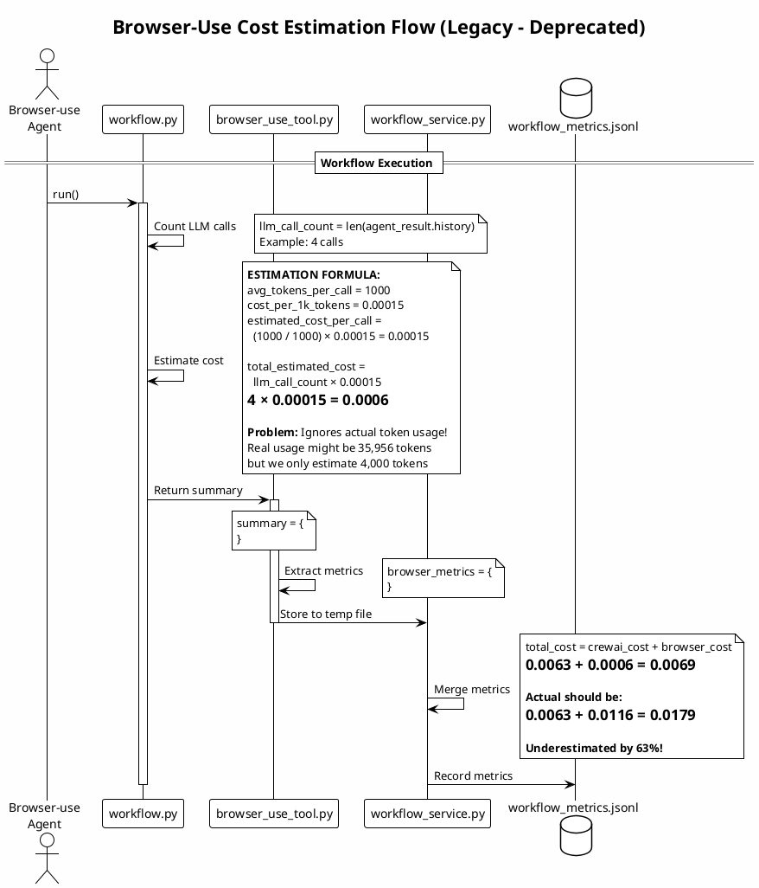
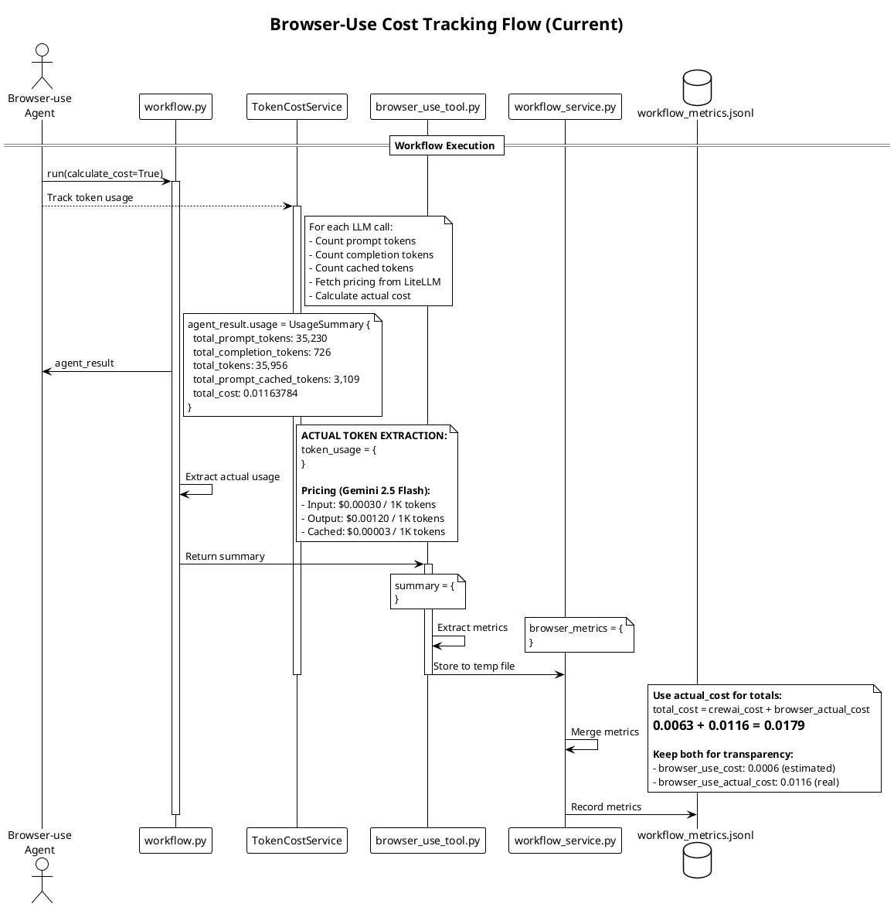

# Cost Tracking Evolution

This document tracks the evolution of cost calculation in the browser-use metrics system.

## Timeline

### Phase 1: Estimated Cost (Deprecated as of 2025-12-27)

Initially, browser-use costs were **estimated** based on LLM call count, not actual token usage.



#### Problems with Estimation

1. **Inaccurate**: Assumed 1000 tokens per call, but actual was ~9000 tokens per call
2. **No vision token accounting**: Vision models use significantly more tokens for screenshots
3. **No cached token accounting**: Ignored prompt caching benefits
4. **Misleading metrics**: Made browser-use appear cheaper than it actually was

#### Example Comparison

| Metric | Estimated | Actual | Error |
|--------|-----------|--------|-------|
| Tokens per call | ~1,000 | ~8,989 | -89% |
| Total tokens | ~4,000 | 35,956 | -89% |
| Cost | $0.0006 | $0.0116 | -95% |

---

### Phase 2: Actual Cost (Current - 2025-12-27)

Now using browser-use 0.9.7's built-in `TokenCostService` with real token tracking.



#### Benefits of Actual Tracking

1. **Accurate**: Real token counts from Google's API
2. **Transparent**: See prompt vs completion vs cached breakdown
3. **Optimizable**: Identify high-token operations
4. **Trustworthy**: Matches actual billing

#### Current Fields

```python
# WorkflowMetrics dataclass
browser_use_cost: float = 0.0              # Actual cost from browser-use (not estimated)
browser_use_tokens: int = 0                # Total tokens
browser_use_prompt_tokens: int = 0         # Input tokens
browser_use_completion_tokens: int = 0     # Output tokens
browser_use_cached_tokens: int = 0         # Cached tokens
```

---

## Migration Guide

### For API Consumers

**Old way (estimated - removed):**
```python
# This was underestimated and has been removed!
# cost = metrics['browser_use_cost']  # Was 0.0006
```

**Current way:**
```python
# Always uses actual cost from browser-use
cost = metrics['browser_use_cost']  # 0.0116 (actual)
```

### Total Cost Calculation

**Formula:**
```python
total_cost = crewai_cost + browser_use_cost
```

Note: `browser_use_cost` now always contains the **actual cost** from browser-use's TokenCostService, not an estimate.

---

## Configuration

To enable cost tracking in browser-use:

```python
from browser_use import Agent

agent = Agent(
    task="...",
    calculate_cost=True,  # Enable TokenCostService
    # ...
)
```

Or via environment variable:
```bash
BROWSER_USE_CALCULATE_COST=true
```

---

## References

- Browser-use TokenCostService: [tokens/service.py](https://github.com/browser-use/browser-use/blob/main/browser_use/tokens/service.py)
- LiteLLM Pricing Data: [model_prices_and_context_window.json](https://github.com/BerriAI/litellm/blob/main/model_prices_and_context_window.json)
- Gemini Pricing: [Google AI Pricing](https://ai.google.dev/pricing)
