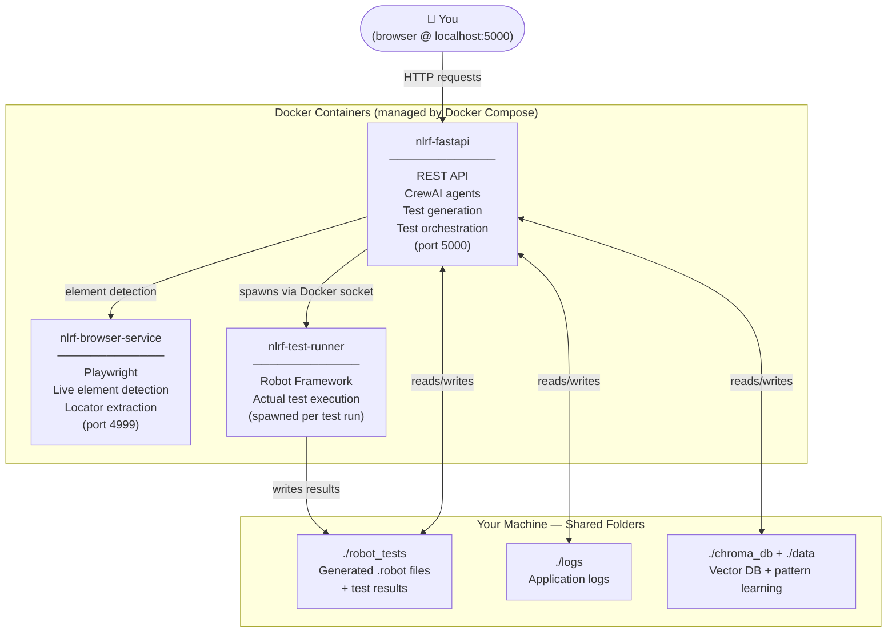
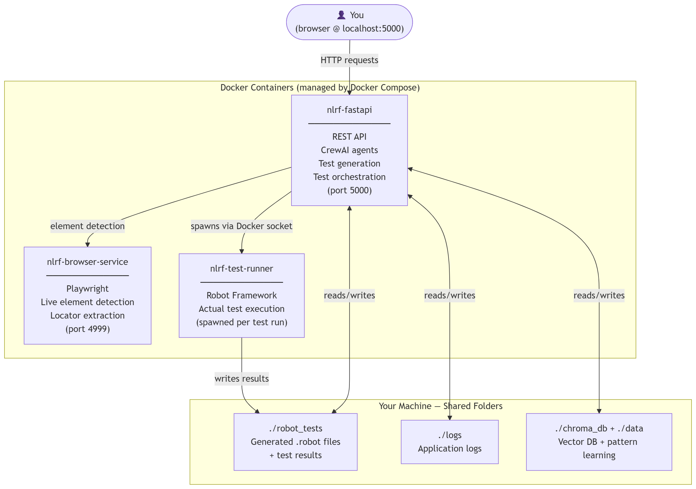
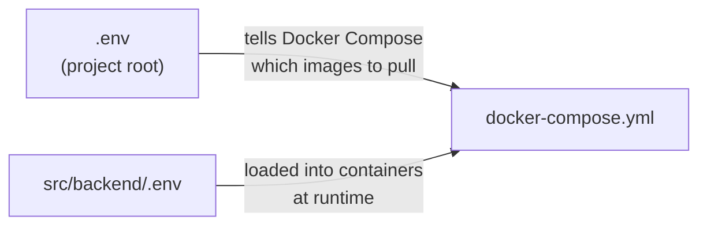
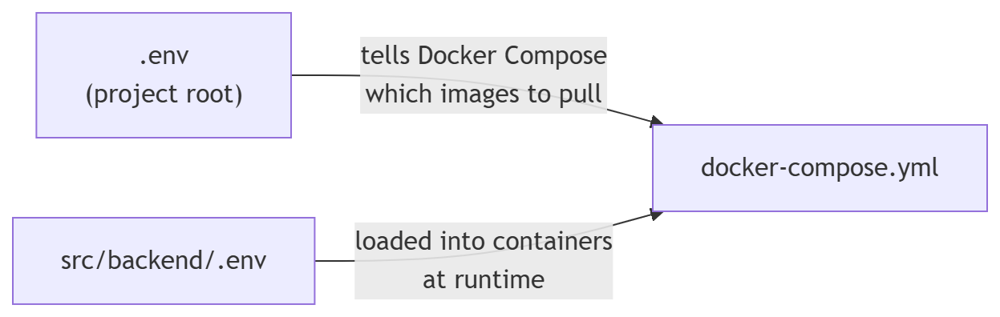

# Getting Started with NLRF via Docker

**Natural Language to Robot Framework (NLRF)** lets you describe what you want to test in plain English, and it generates and runs [Robot Framework](https://robotframework.org/) test scripts for you automatically — no manual test scripting needed.

This guide walks you through running NLRF on your machine using Docker. You do **not** need to install Python, Node.js, or any other dependencies. All you need is Docker and an API key.

---

## What You'll Be Running

NLRF is made up of three Docker containers that work together:



> If the diagram above doesn't render, here's a static version:
>
> 

- **nlrf-fastapi** — the main app. Hosts the UI and API, runs AI agents to understand your test descriptions, and coordinates test execution.
- **nlrf-browser-service** — a headless browser sidecar. Visits your target website to extract real element locators, so generated tests reference actual page elements.
- **nlrf-test-runner** — a short-lived container spawned each time you run tests. It executes the generated `.robot` files using Robot Framework and writes results back to your machine.

All three containers communicate over an internal Docker network. The test files and logs are saved to folders on **your machine** so they persist between restarts.

---

## Prerequisites

Before you start, you need:

1. **Docker Desktop** installed and running
   - [Download for Windows or macOS](https://www.docker.com/products/docker-desktop/)
   - Linux users: install [Docker Engine](https://docs.docker.com/engine/install/) + the [Compose plugin](https://docs.docker.com/compose/install/)

2. **A Google Gemini API key** (free tier is sufficient)
   - Get one at [Google AI Studio](https://aistudio.google.com/app/apikey) — sign in with a Google account, click **Get API key**, and copy it.

That's it. No Python, no Node.js, no pip installs.

---

## Setup

### Step 1 — Get the code

```bash
git clone https://github.com/monkscode/Natural-Language-to-Robot-Framework.git
cd Natural-Language-to-Robot-Framework
```

> Don't have git? You can also [download the repository as a ZIP](https://github.com/monkscode/Natural-Language-to-Robot-Framework/archive/refs/heads/main.zip) and unzip it.

---

### Step 2 — Create the two configuration files

NLRF uses two separate `.env` files, each serving a different purpose:



> If the diagram above doesn't render, here's a static version:
>
> 

**Why two files?** The root `.env` is about *infrastructure* (which version of the app to run). The backend `.env` is about *configuration* (your API key, which AI model to use, feature toggles). Keeping them separate means you can swap image versions without touching your API key, and vice versa.

---

#### File 1: `.env` (project root)

This file tells Docker Compose which pre-built images to download from Docker Hub.

Create it by copying the example:

```bash
cp .env.example .env
```

The file contains three variables — one per container image:

```env
# .env
# All three should use the same version tag.

FASTAPI_IMAGE_TAG=monkscode/nlrf:fastapi-latest
BROWSER_SERVICE_IMAGE_TAG=monkscode/nlrf:browser-service-latest
TEST_RUNNER_IMAGE_TAG=monkscode/nlrf:test-runner-latest
```

**Available tag variants:**

| Tag suffix | When to use |
|---|---|
| `fastapi-latest` | Recommended — stable release from the `main` branch |
| `fastapi-develop` | Latest development build (may be unstable) |
| `fastapi-pr-<N>` | A specific pull request build, e.g. `fastapi-pr-50` |
| `fastapi-<commit>` | Pinned to a specific commit SHA |

> Always use the same suffix for all three tags. Mixing versions (e.g. fastapi-latest with test-runner-develop) can cause compatibility issues.

---

#### File 2: `src/backend/.env`

This file holds your API key and controls how the app behaves at runtime.

Create it by copying the example:

```bash
cp src/backend/.env.example src/backend/.env
```

Now open `src/backend/.env` and set your Gemini API key — **this is the only thing you must change**:

```env
# src/backend/.env

# ✅ REQUIRED: paste your Gemini API key here
GEMINI_API_KEY=your_api_key_here

# Everything below has sensible defaults — you don't need to change these to get started.

MODEL_PROVIDER=gemini
ONLINE_MODEL=gemini-2.5-flash

ROBOT_LIBRARY=browser       # Use Playwright-based tests (recommended)
BROWSER_HEADLESS=true       # Run browser in background (no visible window)
```

See the [full configuration reference](#configuration-reference) at the bottom of this page if you want to customise things further.

---

### Step 3 — Start the app

```bash
docker compose up -d
```

On the **first run**, Docker will pull all three images from Docker Hub. This can take 2–5 minutes depending on your connection speed.

Once the images are downloaded, check that both services started correctly:

```bash
docker compose ps
```

Wait until you see both marked as `healthy`:

```
NAME                     STATUS
nlrf-fastapi             Up (healthy)
nlrf-browser-service     Up (healthy)
```

> The browser service can take up to **2 minutes** to become healthy on first start — it's initialising Playwright internally. This is normal.

Open **[http://localhost:5000](http://localhost:5000)** in your browser. NLRF is ready to use.

---

## Day-to-Day Usage

### Stop the app

```bash
docker compose down
```

Your test files, logs, and database are preserved in local folders (`./robot_tests`, `./logs`, etc.).

### Start again

```bash
docker compose up -d
```

### Update to a newer version

1. Edit `.env` and change the three image tags to the new version.
2. Run:

```bash
docker compose pull
docker compose up -d
```

Your data is preserved. Only the container images are replaced.

### View live logs

```bash
# Both services
docker compose logs -f

# FastAPI only
docker compose logs -f fastapi

# Browser service only
docker compose logs -f browser-service
```

---

## What Gets Saved to Your Machine

After you start the app and generate your first test, your project folder will look like this:

```
Natural-Language-to-Robot-Framework/
│
├── .env                     ← YOU CREATED: image tags
├── docker-compose.yml
│
├── robot_tests/             ← Generated .robot test files + HTML results
├── logs/                    ← Application logs (also viewable in the UI)
├── data/                    ← Generated JWT secret + local artifacts (auto-created)
│
└── src/
    └── backend/
        └── .env             ← YOU CREATED: API key + settings
```

None of these folders are committed to git — they're yours and stay on your machine.

---

## Troubleshooting

### "Containers never become healthy" or app won't start

```bash
docker compose logs fastapi
docker compose logs browser-service
```

Read the output — it will tell you exactly what's wrong. Common causes:

| Symptom in logs | Fix |
|---|---|
| `FileNotFoundError` or `env file not found` | You haven't created `src/backend/.env` yet — run `cp src/backend/.env.example src/backend/.env` |
| `401` / `403` / `API key invalid` | Your `GEMINI_API_KEY` in `src/backend/.env` is wrong or empty |
| `address already in use` on port 5000 or 4999 | Another app is using that port — stop it, or edit the port mapping in `docker-compose.yml` |

### "Browser service is still starting" (after 2+ minutes)

The browser service sometimes takes longer on the very first pull because it downloads browser binaries. Try waiting a full 3 minutes before investigating. If it still doesn't become healthy, run `docker compose logs browser-service` to see what's stuck.

### "Tests don't run" or "cannot connect to Docker"

NLRF runs tests inside a separate container, which it spawns using your machine's Docker socket. This requires Docker to be running on your host. On Windows/macOS, Docker Desktop must be open. On Linux, run `sudo systemctl start docker` if needed.

### Windows: generated tests can't be found by the test runner

The test-runner container sometimes can't locate the test files on Windows due to how Docker resolves paths. Fix it by setting the host path explicitly in your root `.env`:

```env
# .env (project root)
HOST_ROBOT_TESTS_DIR=C:/Users/YourName/Documents/GitHub/Natural-Language-to-Robot-Framework/robot_tests
```

Use forward slashes, not backslashes, even on Windows.

### Start completely fresh (wipe all data)

```bash
docker compose down -v
rm -rf robot_tests logs chroma_db data
docker compose up -d
```

---

## Using a Local AI Model Instead of Gemini

If you'd prefer not to use a cloud API, NLRF can use [Ollama](https://ollama.com/) to run a local model on your machine.

1. Install Ollama and pull a model:
   ```bash
   ollama pull qwen2.5-coder:14b
   ```

2. In `src/backend/.env`, change:
   ```env
   MODEL_PROVIDER=local
   LOCAL_MODEL=qwen2.5-coder:14b

   # Docker Desktop on Windows/macOS:
   OLLAMA_API_BASE=http://host.docker.internal:11434

   # Docker Engine on Linux:
   # OLLAMA_API_BASE=http://172.17.0.1:11434
   ```

3. Restart: `docker compose up -d`

No Gemini API key is needed when using a local model.

---

## Configuration Reference

All settings below go in `src/backend/.env`. Only `GEMINI_API_KEY` is required to get started.

### AI Model

| Variable | Default | Description |
|---|---|---|
| `MODEL_PROVIDER` | `gemini` | `gemini` (Google AI Studio), `vertex` (Vertex AI), or `local` (Ollama) |
| `ONLINE_MODEL` | `gemini-2.5-flash` | Bare model name — provider prefix added automatically |
| `GEMINI_API_KEY` | — | **Required for `MODEL_PROVIDER=gemini`.** Your Google AI Studio key |
| `LOCAL_MODEL` | `qwen2.5-coder:14b` | Which Ollama model to use (local mode only) |
| `OLLAMA_API_BASE` | `http://localhost:11434` | URL of your Ollama server |

### Test Generation

| Variable | Default | Description |
|---|---|---|
| `ROBOT_LIBRARY` | `browser` | `browser` (Playwright) — the only supported value; `selenium` fails at startup |
| `MAX_AGENT_ITERATIONS` | `3` | How many times agents retry on failure (1–5) |

### Browser Automation

| Variable | Default | Description |
|---|---|---|
| `BROWSER_HEADLESS` | `true` | `true` = no visible browser window (recommended in Docker) |
| `ENABLE_CUSTOM_ACTIONS` | `true` | Use built-in locator strategies (recommended) |
| `CUSTOM_ACTION_TIMEOUT` | `5` | Seconds before a locator action times out |
| `MAX_LOCATOR_STRATEGIES` | `21` | Number of locator strategies tried per element |

### Optimization & Pattern Learning

| Variable | Default | Description |
|---|---|---|
| `OPTIMIZATION_ENABLED` | `true` | Enable semantic keyword search and pattern learning |
| `OPTIMIZATION_KEYWORD_SEARCH_TOP_K` | `3` | Keywords returned per semantic search query |
| `OPTIMIZATION_PATTERN_CONFIDENCE_THRESHOLD` | `0.7` | Minimum confidence score to use a learned pattern (0–1) |
| `OPTIMIZATION_CONTEXT_PRUNING_ENABLED` | `true` | Remove irrelevant keywords from agent context |
| `OPTIMIZATION_CONTEXT_PRUNING_THRESHOLD` | `0.6` | Minimum confidence for category classification (0–1) |

### Cost Tracking

| Variable | Default | Description |
|---|---|---|
| `TRACK_LLM_COSTS` | `true` | Log estimated token usage and cost per request |

---

## Quick Reference

| Task | Command |
|---|---|
| Start the app | `docker compose up -d` |
| Stop the app | `docker compose down` |
| View logs | `docker compose logs -f` |
| Check status | `docker compose ps` |
| Update images | `docker compose pull && docker compose up -d` |
| Full reset | `docker compose down -v && rm -rf robot_tests logs chroma_db data` |
