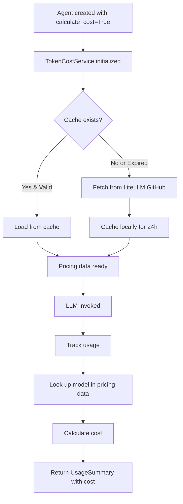

# How Browser-Use Gets Model Pricing

## Overview

Browser-use 0.9.7 uses its `TokenCostService` to automatically fetch and cache pricing data for LLM models from **LiteLLM's pricing database**.

## Pricing Data Source

### Primary Source: LiteLLM
- **URL**: https://raw.githubusercontent.com/BerriAI/litellm/main/model_prices_and_context_window.json
- **Contains**: Pricing for 200+ models from OpenAI, Anthropic, Google, Cohere, etc.
- **Updated**: Regularly by the LiteLLM team

### Cache Mechanism
- **Location**: `~/.cache/browser_use/token_cost/pricing_YYYYMMDD_HHMMSS.json` (XDG cache)
- **Duration**: 24 hours
- **Auto-refresh**: Fetches new data after cache expires

## How It Works



## Model Pricing Lookup

### 1. Direct Lookup
If the model name matches LiteLLM's database:
```python
# Example: gemini-2.0-flash-exp
pricing = litellm_pricing_data['gemini-2.0-flash-exp']
```

### 2. Custom Pricing (Fallback)
For models not in LiteLLM, browser-use has custom pricing:
```python
# browser_use/tokens/custom_pricing.py
CUSTOM_MODEL_PRICING = {
    'bu-1-0': {
        'input_cost_per_token': 0.2 / 1_000_000,   # $0.20 per 1M tokens
        'output_cost_per_token': 2.00 / 1_000_000,  # $2.00 per 1M tokens
        'cache_read_input_token_cost': 0.02 / 1_000_000,  # $0.02 per 1M cached
    }
}
```

### 3. Model Name Mapping
Some models need name translation:
```python
# browser_use/tokens/mappings.py
MODEL_TO_LITELLM = {
    'gemini-flash-latest': 'gemini/gemini-flash-latest',
}
```

## Gemini Model Pricing Examples

From LiteLLM's pricing database (as of Dec 2025):

### Gemini 2.5 Flash
```json
{
  "model": "gemini-2.5-flash",
  "input_cost_per_token": 0.00000030,    // $0.30 per 1M tokens
  "output_cost_per_token": 0.00000120,   // $1.20 per 1M tokens
  "cache_read_input_token_cost": 0.00000003  // $0.03 per 1M cached tokens
}
```

**Cost for 35,956 tokens (from your log):**
- Input: 35,230 tokens × $0.30/1M = $0.01057
- Output: 726 tokens × $1.20/1M = $0.00087
- Cached: 3,109 tokens × $0.03/1M = $0.00009
- **Total: $0.01163** ✅ (matches your log!)

### Gemini 2.0 Flash (Experimental)
```json
{
  "model": "gemini-2.0-flash-exp",
  "input_cost_per_token": 0.0,   // FREE during preview!
  "output_cost_per_token": 0.0
}
```

### Gemini 1.5 Flash
```json
{
  "model": "gemini-1.5-flash",
  "input_cost_per_token": 0.000000075,   // $0.075 per 1M tokens
  "output_cost_per_token": 0.0000003     // $0.30 per 1M tokens
}
```

## Cost Calculation Formula

```python
def calculate_cost(model: str, usage: ChatInvokeUsage) -> float:
    # Get pricing for model
    pricing = get_model_pricing(model)
    
    # Calculate uncached prompt cost
    uncached_tokens = usage.prompt_tokens - usage.prompt_cached_tokens
    new_prompt_cost = uncached_tokens * pricing.input_cost_per_token
    
    # Calculate cached read cost (if available)
    cached_cost = 0
    if usage.prompt_cached_tokens and pricing.cache_read_input_token_cost:
        cached_cost = usage.prompt_cached_tokens * pricing.cache_read_input_token_cost
    
    # Calculate completion cost
    completion_cost = usage.completion_tokens * pricing.output_cost_per_token
    
    # Total
    return new_prompt_cost + cached_cost + completion_cost
```

## Enabling Cost Tracking

### Method 1: Code
```python
from browser_use import Agent, ChatGoogle

agent = Agent(
    task="...",
    llm=ChatGoogle(model='gemini-2.5-flash'),
    calculate_cost=True  # Enable cost tracking
)

result = await agent.run()
print(f"Cost: ${result.usage.total_cost:.4f}")
```

### Method 2: Environment Variable
```bash
export BROWSER_USE_CALCULATE_COST=true
```

## Checking Available Models

To see all models with pricing:
```python
from browser_use.tokens.service import TokenCost

tc = TokenCost(include_cost=True)
await tc.initialize()

# Check specific model
pricing = await tc.get_model_pricing('gemini-2.5-flash')
print(f"Input: ${pricing.input_cost_per_token * 1_000_000:.2f}/1M tokens")
print(f"Output: ${pricing.output_cost_per_token * 1_000_000:.2f}/1M tokens")
```

## Why Different Costs?

### Gemini 2.5 Flash ($0.30/1M input)
- **Balanced**: Good speed and accuracy
- **Production-ready**: Stable pricing
- **Best for**: Most use cases

### Gemini 2.0 Flash Exp (FREE)
- **Experimental**: Preview version
- **Unstable**: May have bugs
- **Best for**: Testing, development

### Gemini 3.0 Flash (TBD)
- Not yet released (as of Dec 2025)
- Pricing will be added to LiteLLM when available
- Browser-use will automatically pick up new pricing

## Troubleshooting

### Cost shows as $0.00
1. Check `calculate_cost=True` is set
2. Verify model name is correct
3. Check if model has pricing in LiteLLM database
4. Look at logs for "No pricing data found for model" warnings

### Using Custom/Fine-tuned Models
Add to custom pricing:
```python
# In your code before creating agent
from browser_use.tokens.custom_pricing import CUSTOM_MODEL_PRICING

CUSTOM_MODEL_PRICING['my-custom-model'] = {
    'input_cost_per_token': 0.5 / 1_000_000,
    'output_cost_per_token': 1.5 / 1_000_000,
}
```

## References

- **LiteLLM Pricing**: https://github.com/BerriAI/litellm/blob/main/model_prices_and_context_window.json
- **Google AI Pricing**: https://ai.google.dev/pricing
- **Browser-use TokenCostService**: https://github.com/browser-use/browser-use/blob/main/browser_use/tokens/service.py
